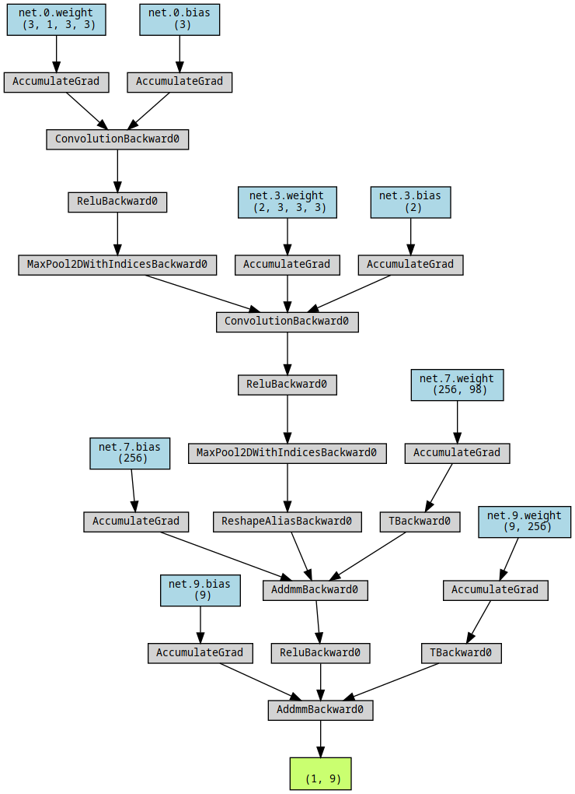
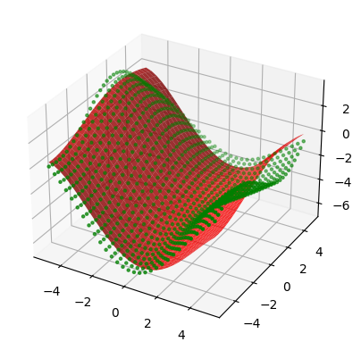
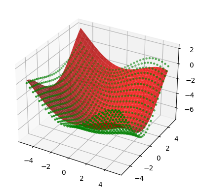
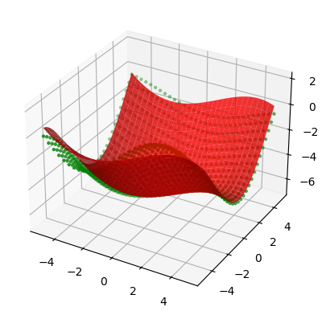

# Point Cloud Fitting

Neural network for fitting a parametric surface to a point cloud.

Fitting a parametric surface to a point cloud can be useful for many applications, notably in autonomous navigation where a drivable surface must be mapped for path traversal and controls.  

This repo is a precursor to the road surface mapping and projection module in the [WATonomous](https://www.watonomous.ca/) codebase. 

### Neural Network Architecture

# Data generation and training
Data was generated using a perlin noise function which generates random smooth curves. The neural network outputs a list of coefficients to be applied to a vector-valued polynomial to output a surface. Then, a mean squared loss function is applied to the differences in Z value between the perlin reference surface and the generated surface.

# Results

